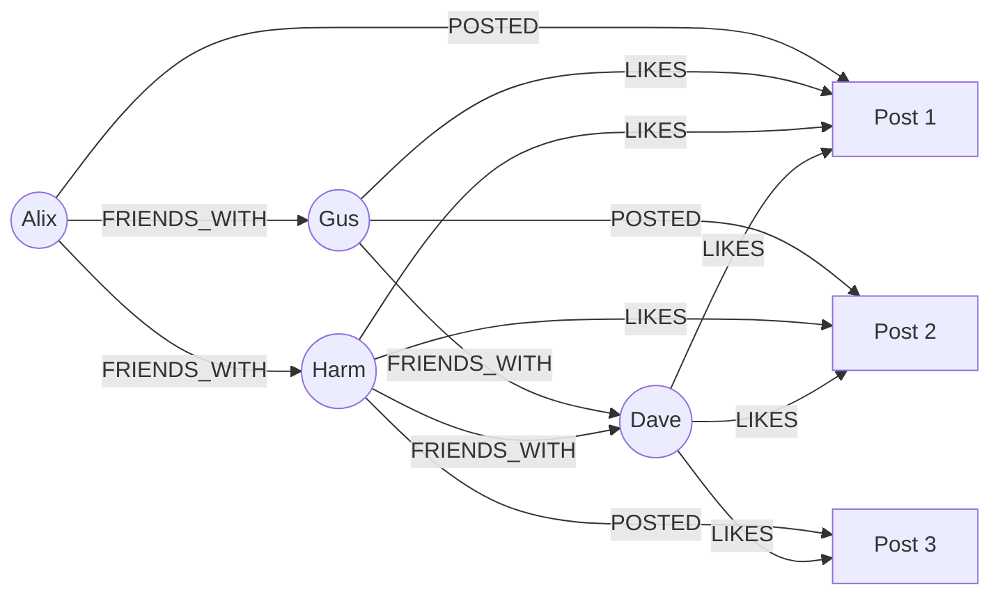

# First Graph

This tutorial walks through building a simple social network graph to cover the fundamentals of Grafeo.

## What This Builds

A social network with:

- **People** with names, ages and locations
- **Friendships** between people
- **Posts** created by people
- **Likes** on posts

## Step 1: Create the Database

=== "Python"

    ```python
    import grafeo

    # Create a persistent database
    db = grafeo.GrafeoDB("social_network.db")
    ```

=== "Rust"

    ```rust
    use grafeo::GrafeoDB;

    let db = GrafeoDB::new("social_network.db")?;
    ```

## Step 2: Add People

=== "Python"

    ```python
    db.execute("""
        INSERT (:Person {
            name: 'Alix',
            age: 30,
            location: 'New York'
        })
        INSERT (:Person {
            name: 'Gus',
            age: 25,
            location: 'San Francisco'
        })
        INSERT (:Person {
            name: 'Harm',
            age: 35,
            location: 'New York'
        })
        INSERT (:Person {
            name: 'Dave',
            age: 28,
            location: 'Los Angeles'
        })
    """)
    ```

=== "Rust"

    ```rust
    let mut session = db.session();

    session.execute(r#"
        INSERT (:Person {
            name: 'Alix',
            age: 30,
            location: 'New York'
        })
        INSERT (:Person {
            name: 'Gus',
            age: 25,
            location: 'San Francisco'
        })
        INSERT (:Person {
            name: 'Harm',
            age: 35,
            location: 'New York'
        })
        INSERT (:Person {
            name: 'Dave',
            age: 28,
            location: 'Los Angeles'
        })
    "#)?;
    ```

## Step 3: Create Friendships

=== "Python"

    ```python
    # Alix knows Gus and Harm
    db.execute("""
        MATCH (a:Person {name: 'Alix'}), (b:Person {name: 'Gus'})
        INSERT (a)-[:FRIENDS_WITH {since: 2020}]->(b)
    """)

    db.execute("""
        MATCH (a:Person {name: 'Alix'}), (c:Person {name: 'Harm'})
        INSERT (a)-[:FRIENDS_WITH {since: 2019}]->(c)
    """)

    # Gus knows Dave
    db.execute("""
        MATCH (b:Person {name: 'Gus'}), (d:Person {name: 'Dave'})
        INSERT (b)-[:FRIENDS_WITH {since: 2021}]->(d)
    """)

    # Harm knows Dave
    db.execute("""
        MATCH (c:Person {name: 'Harm'}), (d:Person {name: 'Dave'})
        INSERT (c)-[:FRIENDS_WITH {since: 2022}]->(d)
    """)
    ```

=== "Rust"

    ```rust
    let mut session = db.session();

    session.execute(r#"
        MATCH (a:Person {name: 'Alix'}), (b:Person {name: 'Gus'})
        INSERT (a)-[:FRIENDS_WITH {since: 2020}]->(b)
    "#)?;

    session.execute(r#"
        MATCH (a:Person {name: 'Alix'}), (c:Person {name: 'Harm'})
        INSERT (a)-[:FRIENDS_WITH {since: 2019}]->(c)
    "#)?;

    session.execute(r#"
        MATCH (b:Person {name: 'Gus'}), (d:Person {name: 'Dave'})
        INSERT (b)-[:FRIENDS_WITH {since: 2021}]->(d)
    "#)?;

    session.execute(r#"
        MATCH (c:Person {name: 'Harm'}), (d:Person {name: 'Dave'})
        INSERT (c)-[:FRIENDS_WITH {since: 2022}]->(d)
    "#)?;
    ```

## Step 4: Add Posts

=== "Python"

    ```python
    db.execute("""
        INSERT (:Post {
            id: 1,
            content: 'Hello, world!',
            created_at: '2024-01-15'
        })
        INSERT (:Post {
            id: 2,
            content: 'Learning Grafeo is fun!',
            created_at: '2024-01-16'
        })
        INSERT (:Post {
            id: 3,
            content: 'Graph databases are amazing.',
            created_at: '2024-01-17'
        })
    """)

    # Connect posts to authors
    db.execute("""
        MATCH (a:Person {name: 'Alix'}), (p:Post {id: 1})
        INSERT (a)-[:POSTED]->(p)
    """)

    db.execute("""
        MATCH (b:Person {name: 'Gus'}), (p:Post {id: 2})
        INSERT (b)-[:POSTED]->(p)
    """)

    db.execute("""
        MATCH (c:Person {name: 'Harm'}), (p:Post {id: 3})
        INSERT (c)-[:POSTED]->(p)
    """)
    ```

## Step 5: Add Likes

=== "Python"

    ```python
    # Gus likes Alix's post
    db.execute("""
        MATCH (b:Person {name: 'Gus'}), (p:Post {id: 1})
        INSERT (b)-[:LIKES]->(p)
    """)

    # Harm likes Alix's and Gus's posts
    db.execute("""
        MATCH (c:Person {name: 'Harm'}), (p:Post)
        WHERE p.id IN [1, 2]
        INSERT (c)-[:LIKES]->(p)
    """)

    # Dave likes all posts
    db.execute("""
        MATCH (d:Person {name: 'Dave'}), (p:Post)
        INSERT (d)-[:LIKES]->(p)
    """)
    ```

## Step 6: Query the Graph

Now let's explore the social network:

### Find All Friends of Alix

=== "Python"

    ```python
    result = db.execute("""
        MATCH (a:Person {name: 'Alix'})-[:FRIENDS_WITH]->(friend)
        RETURN friend.name, friend.location
    """)

    print("Alix's friends:")
    for row in result:
        print(f"  - {row['friend.name']} from {row['friend.location']}")
    ```

### Find Friends of Friends

=== "Python"

    ```python
    result = db.execute("""
        MATCH (a:Person {name: 'Alix'})-[:FRIENDS_WITH]->()-[:FRIENDS_WITH]->(fof)
        WHERE fof <> a
        RETURN DISTINCT fof.name
    """)

    print("Friends of Alix's friends:")
    for row in result:
        print(f"  - {row['fof.name']}")
    ```

### Find People in the Same Location

=== "Python"

    ```python
    result = db.execute("""
        MATCH (p:Person)
        RETURN p.location AS location, collect(p.name) AS people
    """)

    print("People by location:")
    for row in result:
        print(f"  {row['location']}: {row['people']}")
    ```

### Find Most Liked Posts

=== "Python"

    ```python
    result = db.execute("""
        MATCH (p:Post)<-[:LIKES]-(person)
        MATCH (author)-[:POSTED]->(p)
        RETURN p.content AS post, author.name AS author, count(person) AS likes
        ORDER BY likes DESC
    """)

    print("Posts by popularity:")
    for row in result:
        print(f"  '{row['post']}' by {row['author']} - {row['likes']} likes")
    ```

### Find Mutual Friends

=== "Python"

    ```python
    result = db.execute("""
        MATCH (a:Person {name: 'Alix'})-[:FRIENDS_WITH]->(mutual)<-[:FRIENDS_WITH]-(b:Person {name: 'Gus'})
        RETURN mutual.name
    """)

    print("Mutual friends of Alix and Gus:")
    for row in result:
        print(f"  - {row['mutual.name']}")
    ```

## The Complete Graph

Here is a visualization of the completed graph:



## Next Steps

Congratulations on building a first graph application. Continue learning:

- [Configuration](configuration.md) - Optimize the database
- [GQL Query Language](../user-guide/gql/index.md) - Master the query language
- [Tutorials](../tutorials/index.md) - More real-world examples
